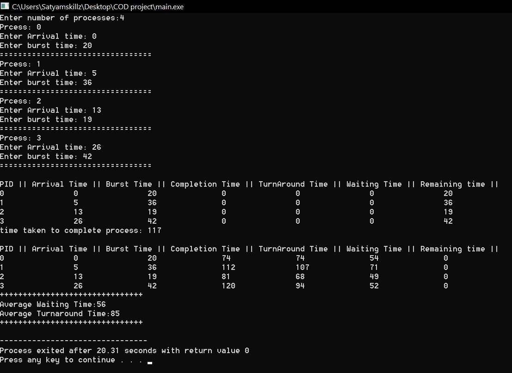

<h1>Question 1</h1>
<h5>
Considering the arrival time and burst time requirement of the process the scheduler
schedules the processes by interrupting the processor after every 6 units of time and does
consider the completion of the process in this iteration. The scheduler than checks for the number
of process waiting for the processor and allots the processor to the process but interrupting the
processor every 10 unit of time and considers the completion of the processes in this iteration.
The scheduler checks the number of processes waiting in the queue for the processor after the
second iteration and gives the processor to the process which needs more time to complete than
the other processes to go in the terminated state.
The inputs for the number of requirements, arrival time and burst time should be provided by the
user.
</h5>
<h2>
Consider the following units for reference.</h2>
<table>
<tr style="background-color: black; color: aliceblue">
<th>process</th>
<th> Arrival time</th>
<th>Brust Time</th>
</tr>
<tr>
<td>P1</td>
<td>0</td>
<td>20</td>
</tr>
<tr>
<td>P2</td>
<td>5</td>
<td>36</td>
</tr>
<tr>
<td>P3</td>
<td>13</td>
<td>19</td>
</tr>
<tr>
<td>P4</td>
<td>26</td>
<td>42</td>
</tr>
</table>
<h5>
Develop a scheduler which submits the processes to the processor in the defined scenario, and
compute the scheduler performance by providing the waiting time for process, turnaround time
for process and average waiting time and turnaround time.
</h5>

